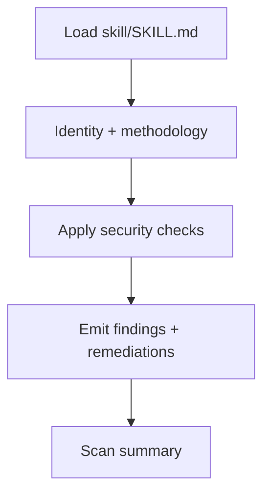

<div align="center" id="readme-top">

# Check Code Skill

**Portable secure-code review for coding agents — one file.**

[](https://openagentskills.dev/docs/specification)
[](./LICENSE)

**[Quick start](#quick-start)** · **[Sample output](#sample-output)** · **[What’s in the skill](#whats-in-the-skill)**

</div>

> Maintained by [UCD-CCI](https://github.com/UCD-CCI). Slimmed/adapted from [joshuaporth/appsec-skill](https://github.com/joshuaporth/appsec-skill) (MIT).  
> Companion intentionally vulnerable demo: [appsec-demo-vulnerable-app](https://github.com/UCD-CCI/appsec-demo-vulnerable-app).

---

<h2 id="quick-start">Quick start</h2>

The entire skill is **[`skill/SKILL.md`](./skill/SKILL.md)** — upload or load that one file.

**Chat UI (managers / demos):**

1. Upload `skill/SKILL.md`
2. Upload the code to review (for the demo app, `app/main.py` is enough)
3. Prompt:

```text
Follow the Check Code skill in SKILL.md. Review the uploaded application code for security vulnerabilities and report findings in the skill’s format.
```

**IDE / agent host:**

1. Copy [`skill/`](./skill/) into your project (or clone this repo)
2. Load the Check Code skill, then analyze your target path

Try it on the [demo vulnerable app](https://github.com/UCD-CCI/appsec-demo-vulnerable-app).

<h2 id="why-check-code-skill">Why Check Code Skill</h2>

One-shot “check my code for security” prompts tend to miss classes, hallucinate line numbers, and return inconsistent reports. This skill encodes a **repeatable** review pipeline in a single markdown file:

- **Grounded findings** — cite evidence; mark uncertainty explicitly
- **Structured coverage** — methodology, OWASP/CWE checks, language/crypto pitfalls, LLM trust boundaries
- **Actionable output** — stable finding schema with concrete remediations

Works with any host that can load a skill file or accept an uploaded markdown instruction. Compatible with the [Open Agent Skills](https://openagentskills.dev/docs/specification) idea of a `SKILL.md` entrypoint.

<h2 id="how-it-works">How it works</h2>



<h2 id="sample-output">Sample output</h2>

Findings follow the schema inside [`SKILL.md`](./skill/SKILL.md). Real reviews must include every required field; the example below is truncated.

<details>
<summary><strong>Example finding (illustrative)</strong></summary>

**Finding 1: SQL Injection** · `APPSEC-3f1a92c4e0b1` · `app/db.py:12–14` · **HIGH** / P1 · CWE-89

```python
query = f"SELECT * FROM users WHERE id = '{user_id}'"
cur.execute(query)
```

User-controlled `user_id` is interpolated into raw SQL. Use parameterized queries or bound parameters from your stack.

</details>

<h2 id="whats-in-the-skill">What’s in the skill</h2>

One file, these sections:

| Section | Covers |
|---------|--------|
| Identity | Mindset, scope, hard rules |
| Methodology | Three-pass review + severity |
| Security checks | Injection, XSS, authz, crypto, LLM, supply chain |
| Output format | Finding schema, priority, OWASP labels, short fix examples |

<h2 id="license">License</h2>

[MIT License](./LICENSE).

<div align="center">

**[Back to top](#readme-top)**

</div>
